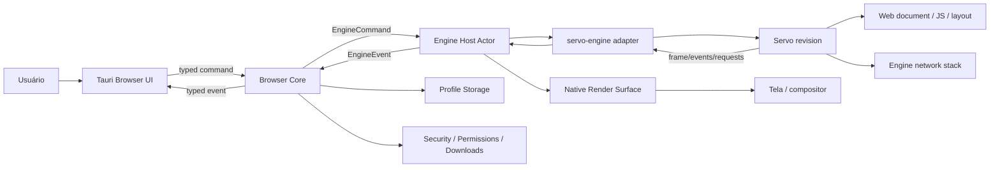
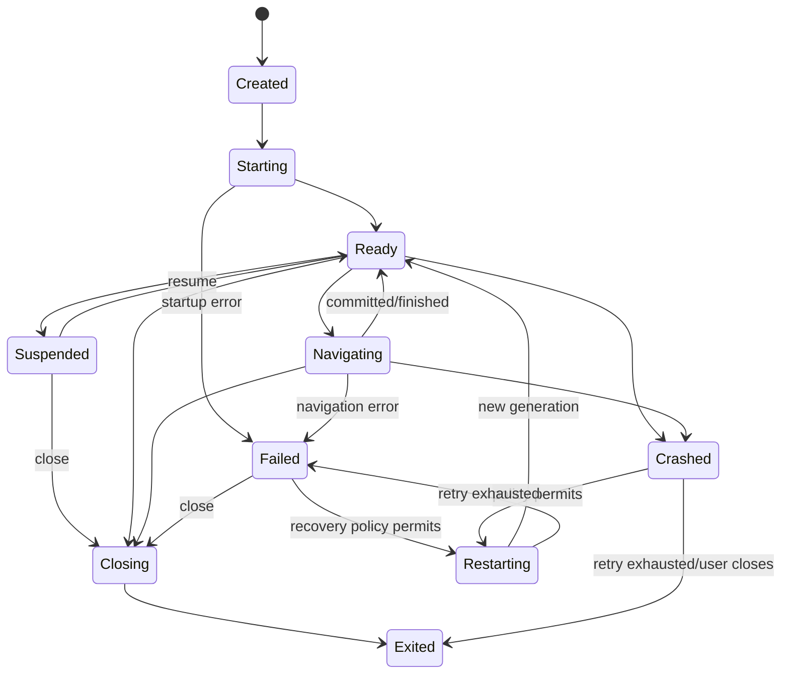

# ARCHITECTURE.md — Navegador Rust/Tauri/Servo

## 1. Architecture stance

A arquitetura é um **browser core Rust com shell Tauri**, não um “site dentro de Tauri”. A UI do navegador é uma superfície privilegiada; páginas web são conteúdo não confiável renderizado por um engine host atrás de `engine-api`. O core possui as state machines e políticas de produto; o engine possui a implementação do Web Platform que sabe executar.

O Servo `main` observado na pesquisa foi `859bd5edd60c0fb162a1f73c083a23e55474faf7`; a revisão é apenas um snapshot de pesquisa, não uma dependência aprovada. O Servo expõe tipos úteis para embedding, mas o Servo Book chama a documentação de embedding esparsa e em andamento.[9][10] Toda integração usa uma revisão fixada, uma feature flag e um adapter.

## 2. Requirements e non-requirements

### Funcionais

- abrir/fechar janela e perfil;
- navegar, recarregar, parar, back/forward;
- criar, fechar, selecionar e restaurar tabs;
- popups/new windows com decisão do browser core;
- history, bookmarks, downloads e permission prompts;
- sessions/profile lifecycle;
- settings, diagnostics, DevTools e extensions somente por milestones próprios;
- uma futura segunda engine somente depois de um contrato comportamental real; não há registry/plugin API no MVP.

### Não funcionais

- Windows, Linux e macOS;
- browser core independente de Tauri e Servo;
- estado determinístico, persistência transacional e recovery;
- UI responsiva sem bloquear event loop;
- backpressure e cancelamento em todas as filas;
- logs estruturados redigidos e diagnostics locais;
- testes repetíveis offline com servidores/fixtures controlados;
- builds e releases auditáveis.

### Segurança

- frontend Tauri sem acesso genérico ao filesystem/process/network;
- commands allowlisted e validados;
- páginas não entram na mesma trust zone da UI;
- políticas explícitas para schemes, downloads, permissions e updates;
- supply chain verificada; secrets fora de PR/fork jobs;
- nenhum claim de sandbox/site isolation sem evidência por OS.

## 3. Context map



O fluxo não implica que o core reimplemente HTTP, DOM, CORS ou layout. O engine executa a web platform; o core governa o que um browser permite fazer com o resultado.

## 4. Componentes

| Componente | Responsabilidade | Interface | Ownership | Falhas | Testes |
|---|---|---|---|---|---|
| `apps/desktop` | composição Tauri, lifecycle de janela e bootstrap | Tauri commands/events, `BrowserSession` | handle de app/window | window close, bridge failure | shell smoke, IPC malformed, platform E2E |
| `frontend/` | omnibox, tabs, sidebar, settings, downloads, history | schema de commands/events | estado de apresentação; não é fonte de verdade | stale UI, double submit | component, accessibility, visual, IPC contract |
| `browser-core` | orquestração, state machines e decisões | `EngineApi`, storage, platform | tabs, profiles, sessions, policies | invalid transition, storage error | unit/property/integration |
| `engine-api` | contrato engine-neutral | commands/events/capabilities/errors | envelopes e IDs; sem DOM | incompatibilidade de versão | fake-engine contract, schema mutation |
| `servo-engine` | tradução para Servo fixado | Servo public API | tipos Servo só aqui | API drift, renderer crash | adapter smoke, revision pin |
| `engine-host` | thread affinity, queues, lifecycle e recovery | bounded command/event channels | host handle e task state | hang, crash, backpressure | lifecycle/concurrency/timeout |
| `render-surface` | surface, viewport, frame presentation | native handle/frame contract | surface resources | resize/present failure | fake/offscreen, platform smoke |
| `storage` | profile DB/files, migrations, atomic writes | repository interfaces | profile-owned persistent data | corruption, lock, migration | clean/upgrade/kill tests |
| `platform` | paths, keychain, window/native handles, OS packaging hooks | small traits | OS resources | unsupported platform | per-OS contract tests |
| `security` | navigation, schemes, permissions, download and IPC policies | pure decisions + audit events | policy inputs/outputs | bypass, stale grants | negative and fuzz tests |
| `test-support` | fake engine, fixture server, temp profiles, assertions | dev-dependency only | test resources | vacuous green | test-infrastructure tests |
| `tooling/xtask` | architecture/CI/release helper commands | CLI | no product runtime state | policy drift | command contract tests |

## 5. Data ownership

| Dado | Dono | Não pertence a |
|---|---|---|
| tab ID, tab state, selected tab | `browser-core/tabs` | frontend, Servo |
| navigation intent/history cursor | `browser-core/navigation` | Servo, UI |
| DOM, JS heap, layout, web document | engine/Servo | browser-core, storage |
| rendered frame/surface | engine host/render surface | frontend state |
| profile path, DB schema, lock | `storage` | Tauri command handlers |
| history/bookmarks/session | core + storage repositories | engine |
| download request decision | security/core | page JS, frontend |
| permission grant | security/core + profile storage | engine, UI |
| UI selection/expanded sidebar | frontend | browser-core |
| diagnostics/tracing fields | telemetry policy | raw page content |

## 6. Engine abstraction — SPI interna mínima

A interface conceitual deve ser async na borda, mas não obrigar o engine interno a ser `Send + Sync`. O handle enviado ao core representa um actor; as operações reais rodam na thread adequada. `BrowserEngine` é uma SPI interna do workspace, compartilhada apenas pelos crates aprovados, não uma API pública de plugins: o primeiro backend é `ServoHost`, e `FakeEngine` existe apenas para a suite contratual. Não criar registry, loader ou matriz universal de capabilities antes de uma segunda engine real.

```rust
pub trait BrowserEngine {
    fn descriptor(&self) -> EngineDescriptor;
    fn capabilities(&self) -> EngineCapabilities;
    fn create(&self, spec: EngineInstanceSpec) -> EngineCreateFuture;
}

pub struct EngineHandle {
    pub instance_id: EngineInstanceId,
    pub api_revision: ApiRevision,
    pub commands: BoundedCommandSender,
    pub events: EventStream,
}
```

O código acima é contrato conceitual para planejamento, não API para implementar nesta execução. Até PR-013/014/020 ratificarem surface, thread model e lifecycle, nenhum item é API pública congelada. O primeiro contrato deve ser mínimo, capability-negotiated e testável pelo fake engine. A extração para uma abstração pública/multi-engine só pode ocorrer após uma segunda implementação real passar pela mesma suite.

### Commands do primeiro contrato

- `CreateWebView` / `DestroyWebView`;
- `Navigate(NavigationRequest)`;
- `Reload(ReloadMode)`;
- `Back` / `Forward`;
- `Stop`;
- `SetViewport(Viewport)`;
- `Input(InputEvent)`;
- `Shutdown`;

O primeiro contrato não inclui `EvaluateScript`, `Devtools`, grants de permission, decisões de download, popup ou dialog. Esses comandos exigem capability, threat model e ADR próprios; o core pode manter workflows internos sem fingir que são parte do engine-neutral API.

Cada command tem `request_id`, `tab_id`/`webview_id`, timeout aplicável e resultado com erro tipado. Repetição deve ser idempotente quando possível; comandos do primeiro subset devem declarar semântica de cancelamento. Script evaluation está fora deste contrato e exige ADR/capability própria.

### Events do primeiro contrato

- `EngineStarted`, `EngineReady`, `EngineExited`, `EngineCrashed`;
- `NavigationStarted`, `NavigationCommitted`, `NavigationFinished`, `NavigationFailed`, `NavigationCancelled`;
- `UrlChanged`, `TitleChanged`, `LoadProgress`;
- `FrameReady`, `FocusChanged`;
- `QueueSaturated`, `CommandCompleted`, `CommandCancelled`, `CommandTimedOut`;
- `WebPlatformError` redigido e versionado.

`PopupRequested`, `DialogRequested`, `PermissionRequested`, `DownloadRequested`, `AuthenticationRequested`, `ConsoleMessage`, `DevtoolsEvent`, `CursorChanged` e `InputMethodRequested` são extensões posteriores: cada uma entra somente após capability negotiation, policy do core e testes negativos.

Events carregam `event_id`, `engine_instance_id`, `webview_id`, navigation ID quando aplicável, timestamp monotônico e payload versionado. Eventos stale são descartados pelo core usando generation/token de navegação.

### Responsabilidade Servo versus core

| Área | Servo/adapter | Browser core |
|---|---|---|
| DOM/JS/layout/render | executa | não reimplementa |
| HTTP/document loading | engine, sob hooks disponíveis | policy/observação/decisão de browser |
| navigation request | informa/solicita | valida scheme, profile e policy |
| history cursor/tab history | emite eventos técnicos | mantém histórico de browser |
| downloads | emite request e bytes/stream conforme API | decide destino, quota, filename, quarantine |
| permissions | emite request contextual | decide, persiste grant e expiração |
| popups/dialogs | emite request | decide política de abertura e UI |
| DevTools | capability técnica | autoriza, expõe UI e redige dados |
| crash | detecta/propaga | marca tab, salva estado e recupera |
| storage/history/bookmarks | não possui autoridade | repositories do core/storage |

## 7. Rendering, input e lifecycle

O `render-surface` esconde window handles, GPU/software paths, scale factor e apresentação. O adapter Servo recebe um `RenderingContext`/surface aprovado pelo spike e liga `WebViewDelegate::notify_new_frame_ready` a `WebView::paint` e `RenderingContext::present`, conforme a documentação inline observada.[10]

O input percorre `UI/native event → render-surface/platform normalization → EngineCommand::Input → WebView::notify_input_event → Servo::spin_event_loop`. Resize usa o mesmo caminho com coalescing e último valor vencedor. Input não é aceito diretamente da página ou do frontend sem validação de tab/window.

Lifecycle:



As transições completas, fencing, terminalidade e interleavings obrigatórios estão em [`docs/contracts/runtime-lifecycle.md`](docs/contracts/runtime-lifecycle.md). O diagrama acima não é suficiente para autorizar implementação: qualquer caminho não listado deve falhar fechado e produzir diagnóstico.

## 8. Concorrência

- **Tauri event loop:** UI/window/lifecycle; não bloqueá-lo com IO ou `spin_event_loop` prolongado.
- **Browser core actor:** recebe commands tipados, serializa transições e coordena repositories.
- **Tokio:** timers, cancellation, storage async, download orchestration e bounded task orchestration; não assume thread safety do Servo.
- **Engine thread/actor:** thread affinity do Servo; seu waker agenda `spin_event_loop` e o actor drena commands com backpressure. Isto é isolamento de afinidade, não boundary de segurança.
- **Channels:** bounded por padrão; input e resize podem coalescer; navigation/download/permission não podem ser silenciosamente descartados.
- **Cancellation:** `CancellationToken` por app/session/tab/navigation; cancelamento produz resultado terminal explícito (`Cancelled`) e libera recursos. Corridas `cancel × completion`, `close × prompt` e `crash × restart` seguem o contrato de runtime.
- **Timeouts:** command timeout é erro observável, não aborto inseguro; engine host pode ser reiniciado somente em estado compatível.
- **Backpressure:** UI recebe acknowledgement e estado, não aguarda frame; filas saturadas entram em diagnostics. Input/resize podem coalescer; commands reliable nunca são descartados silenciosamente. Quotas e lanes precisam do manifest ratificado pelo ADR-005.
- **IPC futuro:** a mesma mensagem versionada de `engine-api` deve poder atravessar processo; no MVP usa channels locais.

## 9. Process model evolutivo

### Inicial: single application process + engine thread

É o menor slice verificável, não um boundary de segurança. O conteúdo permanece no mesmo processo; essa limitação bloqueia claims de sandbox/site isolation e qualquer release Stable.

### Evolução: engine host process

Quando PR-064/065/066 produzirem evidência por OS, PR-069 deve promover o `engine-host` a processo filho de produção para liberar Stable, com:

```text
Browser/Tauri process
  ├── UI bridge
  ├── Browser Core
  └── Process Manager
          │ versioned local IPC
          ▼
     Servo engine host
          ├── page/webview state
          └── render bridge
```

O processo de rede ou GPU não deve ser criado apenas por analogia com outros browsers. Cada split exige threat/performance evidence, custo operacional, crash semantics, permissions e CI por OS. A arquitetura reserva o seam; não implementa um sistema multiprocess no MVP, mas também não permite que o MVP seja promovido a Stable enquanto o engine host continuar in-process.

## 10. Data flows críticos

### URL → tela

1. Usuário digita URL no frontend.
2. UI envia `Navigate` com request ID.
3. Tauri command valida envelope e entrega ao core.
4. Core normaliza URL, aplica scheme/navigation policy e cria navigation generation.
5. Engine host traduz para `WebView::load`/API equivalente.
6. Servo resolve network/document/layout/render internamente.
7. Engine emite progress/commit/title/frame/failure.
8. Core atualiza tab state, history policy e diagnostics.
9. UI recebe eventos tipados; render surface apresenta frame.

### Download

`DownloadRequested(origin, URL, disposition, size?) → core policy → deny/ask/allow → temp file → streamed write → hash/quarantine/rename atomically → UI progress → persisted result`. A página nunca escolhe um caminho arbitrário do filesystem.

### Popup

`CreateNewWebViewRequest(opener, origin, target, features) → core popup policy → existing tab/new tab/window/deny → engine creates webview only after decision`. Opener e target são correlacionados para bloquear spoofing.

### Permission

`PermissionRequested(origin, type, top-level site, tab/profile) → security policy → default deny or user prompt → scoped persistent decision with expiry → engine resolution`. Grants não são globais nem baseados apenas em string enviada pela UI.

### Session restore

`startup → acquire profile lock → migrate/check schema → load last session transaction → validate tab records → restore safe placeholders → explicit navigation restore policy → emit UI state`. Falha parcial não corrompe o profile inteiro.

### Crash

`engine death/hang → host emits Crash → core marks affected tabs → snapshot diagnostic without page secrets → retry only if policy/idempotency safe → recreate tab with last safe URL or blank → UI explains`. Form submissions e downloads não são reenviados automaticamente.

### Shutdown

`close request → stop accepting new commands → drain/deny new downloads → save session atomically → suspend/destroy webviews → close storage → stop engine host → exit`. Timeout deixa diagnóstico e last-known-good state; não mata silenciosamente uma transação.

## 11. Workspace e dependências

Cargo workspace gerencia packages conjuntamente e permite comandos/configuração compartilhados.[1] Bootstrap enxuto:

```text
Cargo.toml
apps/desktop/src-tauri/
frontend/
crates/
  browser-domain/
  browser-core/
  engine-api/
  engine-host/
  servo-engine/
  render-surface/
  storage/
  platform/
  security/
  test-support/        # dev-dependency only
  xtask/
tests/fixtures/
tooling/
docs/
.github/
```

`navigation`, `tabs`, `profiles`, `history`, `bookmarks`, `downloads`, `permissions`, `privacy` começam como módulos de `browser-core` ou `security`; tornam-se crates somente quando contrato, ownership e cadência justificarem a separação. Isso evita transformar a lista conceitual de domínios em dezenas de packages acoplados.

### Grafo permitido

O contrato machine-readable está em [`docs/architecture-graph.yaml`](docs/architecture-graph.yaml). A lista abaixo é explicativa; o checker deve tratar o manifest versionado como autoridade e comparar packages/edges por fase contra `cargo metadata`. Package novo, edge novo, extração de módulo ou mudança do boundary exige PR própria e ADR quando a política do manifest exigir.

```text
browser-domain       → std/serde-like contract only
engine-api           → browser-domain
storage              → browser-domain
platform             → browser-domain
security             → browser-domain
render-surface       → browser-domain + platform contracts
servo-engine         → engine-api + render-surface + Servo
engine-host          → engine-api + render-surface
browser-core        → domain + engine-api + engine-host + storage + security + platform
apps/desktop         → browser-core + platform + Tauri
frontend             → generated UI schema only
xtask/test-support   → dev/tooling edges; never runtime dependency
```

### Dependências proibidas

- `browser-domain → Tauri/Servo/Tokio/filesystem/network`;
- `browser-core → servo-engine` direto;
- `servo-engine → browser-core`;
- `frontend → storage`, `frontend → Servo` ou filesystem genérico;
- `test-support → produção` como dependência normal;
- qualquer crate de domínio dependendo de `apps/desktop`;
- ciclos detectados por `cargo metadata`/`cargo tree`.

A validação será um comando `xtask architecture-check` com o manifest, allowlist de edges e fixtures de bootstrap/transição que falham quando package/edge não declarado, dependência proibida ou ciclo é introduzido. `cargo deny` trata fontes/licenças/advisories; não substitui o verificador de arquitetura.

## 12. `unsafe` e FFI

Crates de domínio/security/core começam com lint `unsafe_code = "forbid"`, configurável no workspace Cargo.[2] Exceções ficam isoladas em `platform`, `render-surface` ou adapter/FFI Servo, com `unsafe_code = "deny"` por padrão e allowlist mínima por módulo. Cada bloco exige comentário `SAFETY`, invariantes, teste que exercite a fronteira e revisão de segurança. `unsafe` nunca é adicionado para contornar uma API difícil.

## 13. Compatibilidade e capacidades

`EngineCapabilities` declara features efetivamente suportadas, mas o primeiro contrato expõe somente o subset aprovado por PR-013/014/015: lifecycle, navigation, frame/input/resize e shutdown. Script evaluation, downloads, popups, dialogs, permissions, devtools e suspend/resume entram como capabilities posteriores somente com ADR/threat model/testes. A UI e o core consultam capabilities; não chamam métodos ausentes esperando `NotImplemented` silencioso. Uma segunda engine deve passar o mesmo `engine-api` contract suite e pode anunciar subset. Stable exige que qualquer capability crítica tenha comportamento e testes definidos.

## 14. Sources

[1] [Cargo Workspaces](https://doc.rust-lang.org/cargo/reference/workspaces.html) · [2] [Cargo lints](https://doc.rust-lang.org/cargo/reference/manifest.html#the-lints-section) · [4] [Tauri Security](https://v2.tauri.app/security/) · [5] [Tauri Capabilities](https://v2.tauri.app/security/capabilities/) · [6] [Tauri Calling Rust](https://v2.tauri.app/develop/calling-rust/) · [8] [Tauri Process Model](https://v2.tauri.app/concept/process-model/) · [9] [Servo Embedding Overview](https://book.servo.org/embedding/overview.html) · [10] [Servo lib.rs](https://github.com/servo/servo/blob/main/components/servo/lib.rs) · [11] [Servo Cargo.toml](https://github.com/servo/servo/blob/main/components/servo/Cargo.toml).

## Sources

[1] https://doc.rust-lang.org/cargo/reference/workspaces.html
[2] https://doc.rust-lang.org/cargo/reference/manifest.html
[4] https://v2.tauri.app/security
[5] https://v2.tauri.app/security/capabilities
[6] https://v2.tauri.app/develop/calling-rust
[8] https://v2.tauri.app/concept/process-model
[9] https://book.servo.org/embedding/overview.html
[10] https://github.com/servo/servo/blob/main/components/servo/lib.rs
[11] https://github.com/servo/servo/blob/main/components/servo/Cargo.toml
