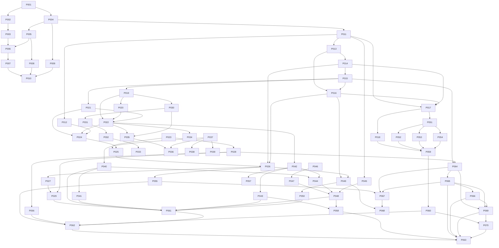

# PR_PLAN.md — DAG executável de Pull Requests

> **Status:** queue normativa aprovada; IDs `PR-001`–`PR-070` são IDs estáveis de planejamento, independentes dos números reais do GitHub. O mapeamento atual e a evidência de Draft PRs vivem em `CURRENT_STATE.md`; nenhum resultado planejado é prova de implementação.
>
> Este DAG cobre a fundação até Stable 1.0 e os primeiros seams de evolução. A representação machine-readable é [`docs/pr-dag.yaml`](docs/pr-dag.yaml); esta tabela e os cards são a leitura humana canônica. Ele não tenta enumerar centenas de PRs de produto futuros; cada card é pequeno o bastante para gerar novas folhas do mesmo contrato sem alterar a autoridade do plano.

## 1. Regras do DAG

- `1 PR = 1 mudança lógica`; PR de feature não mistura refactor de workflow, migration ou release.
- Toda PR tem diff real: código, teste, policy executável, workflow, documentação normativa ou correção verificável. Placeholder/branch vazia é proibido.
- Dependência significa contrato, não apenas arquivo. Merge somente após dependências integradas e gates verdes no SHA atual.
- O Mermaid mostra somente os caminhos principais para leitura rápida; `docs/pr-dag.yaml` é a autoridade machine-readable para todos os edges diretos, ranges expandidos, dependências e invalidação por SHA/tree.
- O `title` machine-readable é o resumo curto da tabela; headings dos cards podem acrescentar contexto editorial, mas ID, dependências, milestone, risco, resultado e gates de autoridade devem permanecer semanticamente idênticos.
- `parallel = sim` só se os owners não disputarem contrato/schema/workflow/engine revision e cada PR tiver fixtures próprias.
- PRs de `.github`, Rulesets, CODEOWNERS, signing, permissions e release têm risco elevado e não entram em auto-merge comum sem canário.
- Rollback é específico: revert de docs/código simples, forward-fix para schema/migration, stop/last-known-good para deploy/update, rotação/revogação para chaves.

## 2. Visão do DAG



## 3. Resumo

| ID | PR | Milestone | Dependências | Paralelizável | Risco | Resultado |
|---|---|---|---|---|---|---|
| 001 | Repository governance | M0 | — | não | baixo | identidade e regras |
| 002 | ADR/document templates | M0 | 001 | sim | baixo | decisões rastreáveis |
| 003 | PR/CODEOWNERS policy | M0 | 001–002 | sim | médio | contribuição controlada |
| 004 | Rust workspace skeleton | M0 | 001 | sim | baixo | workspace real |
| 005 | Toolchain/dependency policy | M0 | 004 | sim | médio | builds determinísticos |
| 006 | CI trust baseline | M0 | 003–005 | não | alto | workflows least privilege |
| 007 | format/lint/docs gate | M0 | 005–006 | sim | baixo | static gate |
| 008 | dependency/security gate | M0 | 005–006 | sim | alto | supply-chain gate |
| 009 | architecture validator | M0 | 004–005 | sim | médio | DAG de crates |
| 010 | quality gate aggregator | M0 | 007–009 | não | alto | merge authority |
| 011 | Tauri shell bootstrap | M1 | 004,007 | sim | médio | app shell |
| 012 | frontend-shell contract | M1 | 011 | sim | médio | UI typed boundary |
| 013 | Servo embedding spike | M1 | 004,011 | sim | alto | evidence de API/event loop |
| 014 | native render surface spike | M1 | 013 | não | alto | surface/input/resize |
| 015 | provisional engine API + fake engine | M1 | 009,013,014 | não | alto | contract mínimo pós-surface |
| 016 | Servo adapter pinned smoke | M1 | 013–015 | não | alto | adapter real |
| 017 | cross-platform host matrix | M1 | 011,014,016 | não | alto | OS evidence |
| 018 | package/release skeleton | M1 | 006,017 | sim | médio | build artifacts |
| 019 | domain IDs/value objects | M2 | 015 | sim | baixo | types estáveis |
| 020 | core actor/lifecycle | M2 | 015,019 | não | alto | state owner + runtime contract |
| 021 | command/event envelopes | M2 | 015,019 | sim | alto | protocol versionado |
| 022 | navigation state machine | M2 | 019–021 | não | alto | navigation policy/state |
| 023 | engine host lifecycle | M2 | 015,020–021 | não | alto | fake-host actor e execução |
| 024 | typed Tauri IPC bridge | M2 | 011–012,021–022 | não | alto | UI/core bridge |
| 025 | single-tab fake-engine vertical slice | M2 | 022–024 | não | alto | core/UI contract slice |
| 026 | real Servo/surface thin integration | M2 | 014,016,025 | não | crítico | first real page/input |
| 027 | nav controls/error UX | M2 | 025–026 | sim | médio | MVP controls |
| 028 | crash/restart policy | M2 | 023,025 | sim | alto | tab recovery |
| 029 | MVP reference-platform E2E/smoke | M2 | 017,027–028 | não | alto | MVP evidence; other OS feasibility |
| 030 | tab domain model | M3 | 019–020 | sim | médio | tab state |
| 031 | tab manager/events | M3 | 022–023,030 | não | alto | lifecycle orchestration |
| 032 | tab strip UI | M3 | 012,024,031 | sim | baixo | visible tab chrome |
| 033 | tab open/close/switch | M3 | 031–032 | não | médio | multi-tab behavior |
| 034 | popup/new-window policy | M3 | 016,022,031 | sim | alto | controlled popups |
| 035 | session schema | M3 | 019,022,030 | sim | alto | persisted contract |
| 036 | session restore/shutdown | M3 | 020,028,035,037 | não | alto | recovery transaction |
| 037 | profile storage/locking | M3 | 019,035 | não | alto | profile owner |
| 038 | history | M3 | 022,037 | sim | médio | durable history |
| 039 | bookmarks | M3 | 032,037 | sim | baixo | durable bookmarks |
| 040 | download broker/policy | M3 | 016,022,037 | não | alto | safe download path |
| 041 | download UI/recovery | M3 | 032,040 | sim | médio | progress/restart |
| 042 | permissions state/policy | M4 | 022,037 | sim | alto | scoped grants |
| 043 | permission prompts | M4 | 024,042 | não | alto | user decision UI |
| 044 | scheme/file navigation security | M4 | 022,040,042 | não | alto | browser security boundary |
| 045 | Tauri CSP/capabilities hardening | M4 | 011–012,024 | não | alto | privileged UI locked |
| 046 | privacy clearing/partition | M4 | 037–039,042 | sim | alto | data control |
| 047 | diagnostics redaction | M4 | 028,046 | sim | médio | safe observability |
| 048 | threat/abuse regression suite | M4 | 044–047 | não | alto | security exit evidence |
| 049 | WPT harness/pin | M5 | 016,026,044 | sim | alto | web compatibility runner |
| 050 | WPT expectations/triage | M5 | 049 | sim | alto | no hidden regressions |
| 051 | platform input/accessibility | M5 | 017,026 | sim | médio | platform contract |
| 052 | Windows packaging | M5 | 018,051 | sim | alto | Windows installer |
| 053 | Linux packaging | M5 | 018,051 | sim | médio | Linux artifact |
| 054 | macOS packaging | M5 | 018,051 | sim | alto | macOS artifact |
| 055 | performance baseline | M5 | 026,029,051 | sim | médio | measured budgets input |
| 056 | stress/fuzz/soak | M5 | 028,049 | sim | alto | resilience corpus |
| 057 | minimal DevTools/diagnostics | M6 | 042,047,049 | sim | alto | controlled debug surface |
| 058 | extensions boundary spike | M6 | 043,045,048 | sim | alto | no premature extension API |
| 059 | signed artifacts/SBOM/provenance | M6 | 008,018,052–054 | não | alto | release trust chain |
| 060 | channels/updater/recovery | M6 | 046,059 | não | alto | verified update |
| 061 | Alpha exit gate | M7 | 029,037,040–041,043,048–050,052–054,059 | não | alto | signed alpha decision |
| 062 | Beta stability gate | M7 | 055–056,060–061 | não | alto | beta decision |
| 063 | Stable 1.0 gate | M8 | 048,050,055–056,058,060,062,065–066,069–070 | não | crítico | stable decision; isolation mandatory |
| 064 | engine host process spike | M8 | 015,028,055 | sim | alto | process seam evidence |
| 065 | process manager/sandbox prototype | M8 | 048,064 | não | crítico | isolation evidence |
| 066 | renderer/site isolation evaluation | M8 | 048,065 | não | crítico | security decision |
| 067 | network/GPU split decision | M8 | 055,064–065 | sim | alto | evidence-based split |
| 068 | second engine adapter | M8 | 015,049,067 | sim | alto | multi-engine proof |
| 069 | production engine-host rollout | M8 | 028,055,064–066 | não | crítico | production process boundary |
| 070 | recovery/security drills | M8 | 060,065–066,069 | não | crítico | operational readiness |

## 4. Cards normativos

### M0 — Foundation

#### PR-001 — Repository governance
- **Objective:** criar README, LICENSE policy, CONTRIBUTING, SECURITY, CODE_OF_CONDUCT, docs map e regra “no direct main”.
- **Dependencies:** —. **Parallel:** não.
- **Scope:** identidade do projeto, ownership e document index. **Out:** código de browser, CI enforcement efetivo.
- **Tests/AC:** links e required sections lintados; novo agente encontra o caminho de leitura; nenhum segredo.
- **Risks/Rollback:** baixo; revert documental.
- **Docs:** README, CONTRIBUTING, SECURITY, `AGENTS.md` bootstrap.

#### PR-002 — ADR and specification templates
- **Objective:** adicionar template ADR, spec/AC template e decision index.
- **Dependencies:** 001. **Parallel:** sim.
- **Scope:** status, contexto, alternativas, consequências, evidence e supersession. **Out:** decisões finais sem spike.
- **Tests/AC:** lint de frontmatter/links; fixture de ADR incompleto falha.
- **Risks/Rollback:** baixo; revert docs.
- **Docs:** `docs/decisions/`, `docs/specs/`.

#### PR-003 — PR/CODEOWNERS/policy contracts
- **Objective:** PR template, issue forms, labels, CODEOWNERS de trust paths e small-PR policy.
- **Dependencies:** 001–002. **Parallel:** sim.
- **Scope:** ownership e metadata. **Out:** branch ruleset efetivo, que exige canário.
- **Tests/AC:** policy checker rejeita PR sem fields; CODEOWNERS paths cobertos.
- **Risks/Rollback:** médio; rollback para policy anterior auditada, sem abrir bypass.
- **Docs:** `PR_PLAN`, CONTRIBUTING, CODEOWNERS.

#### PR-004 — Rust workspace skeleton
- **Objective:** workspace Cargo e packages mínimos compiláveis.
- **Dependencies:** 001. **Parallel:** sim.
- **Scope:** `browser-domain`, `browser-core` vazio, `engine-api`, `test-support` dev-only, `xtask`. **Out:** Servo/Tauri behavior.
- **Tests/AC:** `cargo metadata`, `cargo check --workspace`, package names e resolver definidos.
- **Risks/Rollback:** baixo; remover package ainda não usado.
- **Docs:** ARCHITECTURE crate graph.

#### PR-005 — Toolchain and dependency policy
- **Objective:** rust-toolchain, lock policy, Cargo lints, MSRV/OS support matrix policy inicial, license/source/advisory policy.
- **Dependencies:** 004. **Parallel:** sim.
- **Scope:** reproducibility e dependency review. **Out:** dependency sprawl.
- **Tests/AC:** clean checkout resolves locked toolchain; `unsafe` default e lint policy provados.
- **Risks/Rollback:** médio; forward-fix de policy/toolchain com migration note.
- **Docs:** DEPENDENCIES.md, ADR-001.

#### PR-006 — CI trust baseline
- **Objective:** workflows base com permissions mínimas, actions pinadas, fork-safe triggers e reusable workflow contract.
- **Dependencies:** 003–005. **Parallel:** não.
- **Scope:** workflow security. **Out:** release secrets/publish.
- **Tests/AC:** actionlint; fixture detecta unpinned action, `write` excessivo e checkout inseguro; fork não recebe secrets.
- **Risks/Rollback:** alto; break-glass policy auditada, não disable do gate.
- **Docs:** CI_CD_STRATEGY, security workflow policy.

#### PR-007 — Format/lint/docs gate
- **Objective:** `cargo fmt --check`, Clippy `-D warnings`, rustdoc e metadata checks.
- **Dependencies:** 005–006. **Parallel:** sim.
- **Scope:** static quality. **Out:** domain behavior.
- **Tests/AC:** intentional failure fixtures bloqueiam; warnings não viram sucesso.
- **Risks/Rollback:** baixo; corrigir code/policy, não remover lint.
- **Docs:** DEVELOPMENT/TESTING.

#### PR-008 — Dependency/security gate
- **Objective:** cargo-deny, cargo-audit, secret/dependency scanning e baseline CodeQL quando aplicável.
- **Dependencies:** 005–006. **Parallel:** sim.
- **Scope:** advisories/licenses/sources/secrets. **Out:** product sandbox.
- **Tests/AC:** fixture banned license/advisory/secret falha; report traz SHA/tree.
- **Risks/Rollback:** alto; exceção só com expiry/owner/ADR.
- **Docs:** DEPENDENCIES, SECURITY.

#### PR-009 — Architecture validator
- **Objective:** `xtask architecture-check` comparar `cargo metadata` com `docs/architecture-graph.yaml`, validar packages/edges por fase e detectar ciclos.
- **Dependencies:** 004–005. **Parallel:** sim.
- **Scope:** Cargo metadata/graph rules, transition fixtures e package extraction policy. **Out:** runtime behavior.
- **Tests/AC:** fixture proibida `core→servo-engine`, UI→storage, undeclared package/edge e cycle falham; bootstrap M0 e transição M1 passam somente quando manifest e metadata concordam.
- **Risks/Rollback:** médio; corrigir edge ou ADR, nunca desligar checker.
- **Docs:** ARCHITECTURE, `docs/architecture-graph.yaml`.

#### PR-010 — Quality gate aggregator
- **Objective:** aggregator fail-closed, evidence identity manifest e binding controlado ao check required.
- **Dependencies:** 007–009. **Parallel:** não.
- **Scope:** missing/stale/skipped/malformed/wrong-SHA/merge_group cases; bootstrap OFF/SHADOW/ENFORCED fica documentado e não pode ser inferido localmente. **Out:** IA como authority, Ruleset autodeclarado.
- **Tests/AC:** matriz adversarial completa verde no sucesso e vermelha em cada caso inválido; canário de check ausente e wrong-SHA permanece bloqueante.
- **Risks/Rollback:** alto; rollback para versão anterior somente com Ruleset canário e auditoria.
- **Docs:** CI_CD_STRATEGY, gate schema, `docs/ci/control-plane-runbook.md`.

### M1 — Feasibility

#### PR-011 — Tauri shell bootstrap
- **Objective:** app Tauri mínimo com lifecycle de janela e frontend local.
- **Dependencies:** 004,007,010. **Parallel:** sim.
- **Scope:** shell only. **Out:** page navigation, Servo.
- **Tests/AC:** app abre/fecha em Linux/Windows/macOS conforme runner; no remote URL.
- **Risks/Rollback:** médio; remover shell mantendo workspace.
- **Docs:** ADR-002.

#### PR-012 — Frontend-shell contract
- **Objective:** schema/typed commands/events para UI, sem `invoke` genérico.
- **Dependencies:** 011. **Parallel:** sim.
- **Scope:** omnibox/tabs shell mock e event rendering. **Out:** browser state real.
- **Tests/AC:** malformed/unknown event tests; component/accessibility smoke.
- **Risks/Rollback:** médio; versionar schema e forward-fix.
- **Docs:** UI contract.

#### PR-013 — Servo embedding feasibility spike
- **Objective:** contra uma revisão Servo fixada, provar builder, event loop/waker, webview delegate e lifecycle mínimo.
- **Dependencies:** 004,011. **Parallel:** sim.
- **Scope:** spike descartável com logs/artifacts. **Out:** API pública estável ou feature browser.
- **Tests/AC:** build e create/destroy; `EventLoopWaker`/`spin_event_loop`; resultado explícito para cada OS/limitação, sem tratar documentação como suporte.
- **Risks/Rollback:** alto; decisão pivot para alternativa de surface, sem espalhar workaround.
- **Docs:** ADR-003, spike report com SHA.

#### PR-014 — Native render surface spike
- **Objective:** provar `RenderingContext`/frame/present/input/resize e integração com a janela escolhida.
- **Dependencies:** 013. **Parallel:** não.
- **Scope:** surface native/offscreen/child alternatives. **Out:** compositor final.
- **Tests/AC:** frame visível, `paint/present`, input/resizing e shutdown barrier em OS matrix; wake tardio, frame pendente e failure modes registrados.
- **Risks/Rollback:** alto; escolher surface coordenada/two-window se single-window falhar.
- **Docs:** ADR-002/003/005.

#### PR-015 — Provisional engine API and fake engine
- **Objective:** definir somente o contrato mínimo pós-surface e um testkit fake engine.
- **Dependencies:** 009,013–014. **Parallel:** não.
- **Scope:** commands/events/errors/capabilities/lifecycle mínimos, sem congelar extensões de permission/download/popup/DevTools. **Out:** tipos Servo, IPC real.
- **Tests/AC:** contract suite red/green; unknown versions, cancellation, terminal results e capability negotiation testados; qualquer comando fora do subset é rejeitado.
- **Risks/Rollback:** alto; version bump/superseding ADR, não breaking rename silencioso.
- **Docs:** ADR-004 como decisão proposta/provisória, engine contract, `docs/contracts/runtime-lifecycle.md`. A aceitação/ratificação de ADR-004 é gate posterior antes de PR-020/021/025/026.

#### PR-016 — Servo adapter pinned smoke
- **Objective:** adapter traduzir o contrato mínimo para a revisão Servo aprovada pelo spike.
- **Dependencies:** 013–015. **Parallel:** não.
- **Scope:** create/load/frame/input/shutdown. **Out:** history/download/full web platform.
- **Tests/AC:** fake + real adapter passam contract subset, incluindo wake/spin, frame callback/paint/present, input e shutdown; Servo SHA/toolchain/features/patches registrados.
- **Risks/Rollback:** alto; pin anterior conhecido ou bloquear M2.
- **Docs:** ADR-003, dependency exception.

#### PR-017 — Cross-platform engine host matrix
- **Objective:** executar shell/adapter/surface smoke em Windows/Linux/macOS.
- **Dependencies:** 011,014,016. **Parallel:** não.
- **Scope:** runners, input/scale/window differences. **Out:** packaging final.
- **Tests/AC:** artifact identity por OS; falha de runner não vira pass.
- **Risks/Rollback:** alto; reduzir claim de OS, não esconder falha.
- **Docs:** OS support matrix.

#### PR-018 — Package/release skeleton
- **Objective:** build artifacts não publicados, manifests e clean-install smoke.
- **Dependencies:** 006,017. **Parallel:** sim.
- **Scope:** bundler baseline e checksums. **Out:** signing/update.
- **Tests/AC:** install-launch-uninstall em cada formato suportado; artifact digest.
- **Risks/Rollback:** médio; manter formato somente como experimental.
- **Docs:** RELEASE_STRATEGY.

### M2 — Core/MVP

#### PR-019 — Domain IDs/value objects
- **Objective:** typed IDs para profile/tab/navigation/request/engine e value objects básicos.
- **Dependencies:** 015. **Parallel:** sim.
- **Scope:** serde/display/validation. **Out:** persistence/UI.
- **Tests/AC:** roundtrip, invalid values, no stringly identity.
- **Risks/Rollback:** baixo; migration/adapter aliases.
- **Docs:** ARCHITECTURE.

#### PR-020 — Browser core actor/lifecycle
- **Objective:** core state owner e app/session lifecycle.
- **Dependencies:** 015,019, **ADR-005/runtime manifest accepted**. **Parallel:** não.
- **Scope:** command dispatch, state transitions, cancellation e runtime lifecycle contract. **Out:** navigation specifics.
- **Tests/AC:** illegal transitions, shutdown ordering, queue backpressure, close/start/crash interleavings e exactly-once terminal results.
- **Risks/Rollback:** alto; feature flag/forward-fix, no state reset silently.
- **Docs:** ADR-005.

#### PR-021 — Versioned command/event envelopes
- **Objective:** correlation, generation, capability and schema version handling.
- **Dependencies:** 015,019. **Parallel:** sim.
- **Scope:** serde schema, size limits, unknown rejection. **Out:** transport process.
- **Tests/AC:** malformed/unknown/stale/duplicate cases.
- **Risks/Rollback:** alto; protocol version bump + compatibility adapter.
- **Docs:** ADR-004/007.

#### PR-022 — Navigation state machine
- **Objective:** intent, policy, generations, commit/fail/back/forward/reload/stop.
- **Dependencies:** 019–021. **Parallel:** não.
- **Scope:** pure core state machine. **Out:** Servo network implementation.
- **Tests/AC:** redirects/stale events/cancel/reload/error and history cursor.
- **Risks/Rollback:** alto; keep old state reader, forward-fix.
- **Docs:** navigation spec/ADR.

#### PR-023 — Engine host lifecycle
- **Objective:** dedicated fake-capable engine actor/thread, bounded queues, timeout and crash signal.
- **Dependencies:** 015,020–021, **ADR-005/runtime manifest accepted**. **Parallel:** não.
- **Scope:** host ownership/waker/close/restart signal and runtime quota manifest. **Out:** real Servo surface binding, OS sandbox.
- **Tests/AC:** no UI block, command ordering, saturation, hang/crash injection, reliable-control admission reject, coalescing e deterministic cancel/close races.
- **Risks/Rollback:** alto; disable restart and preserve explicit crashed state.
- **Docs:** ADR-005.

#### PR-024 — Typed Tauri IPC bridge
- **Objective:** bridge UI↔core com allowlist e caller context.
- **Dependencies:** 011–012,021–022. **Parallel:** não.
- **Scope:** commands/events, errors, payload limits. **Out:** privileged plugins.
- **Tests/AC:** unauthorized/malformed/wrong-tab/double-submit blocked.
- **Risks/Rollback:** alto; disable command path, not generic fallback.
- **Docs:** ADR-007, Tauri capabilities map.

#### PR-025 — Single-tab fake-engine vertical slice
- **Objective:** conectar UI, core e host contra o fake engine antes da integração Servo.
- **Dependencies:** 022–024, **ADR-005/runtime manifest accepted**. **Parallel:** não.
- **Scope:** create tab, navigate, events, error state e contract evidence. **Out:** real rendering, Servo, tabs/history/download.
- **Tests/AC:** local fixture control flow, malformed/stale events, cancellation, close e crash state; contract manifest comum fake/real é carregado; no-run/no-frame/skip é `NO_GO`; nenhuma API Servo aparece no core.
- **Risks/Rollback:** alto; revert integration seam, retain fake contract.
- **Docs:** MVP spec.

#### PR-026 — Real Servo/surface thin integration
- **Objective:** conectar o slice aprovado ao adapter Servo e à surface real sem expandir o core contract.
- **Dependencies:** 014,016,025. **Parallel:** não.
- **Scope:** create/load/frame/input/resize/scale/present e normalization/coalescing. **Out:** tabs, downloads, permissions, DevTools e acessibilidade completa.
- **Tests/AC:** fixture HTTP/HTTPS real, click/link, text input, resize, frame readiness, thread affinity e no event-loop deadlock; contract manifest comum, no-run/no-frame/skip `NO_GO`; artifact registra Servo revision, surface strategy, OS e digest.
- **Risks/Rollback:** alto; disable high-frequency path, preserve navigation.
- **Docs:** render/input contract.

#### PR-027 — Navigation controls/error UX
- **Objective:** omnibox state, back/forward/reload/stop/loading/error.
- **Dependencies:** 025–026. **Parallel:** sim.
- **Scope:** browser chrome only. **Out:** tabs/persistence.
- **Tests/AC:** E2E critical controls and stale/error states.
- **Risks/Rollback:** médio; UI fallback to explicit error.
- **Docs:** MVP acceptance.

#### PR-028 — Crash/restart policy
- **Objective:** tab crash/hang state, diagnostics redacted e safe restart.
- **Dependencies:** 023,025. **Parallel:** sim.
- **Scope:** state and recovery, no process sandbox. **Out:** auto-resubmit forms.
- **Tests/AC:** kill/hang/shutdown abrupto em create/load/frame/input/close e writes duráveis; stale replay após restart, checkpoint/abort, terminal result e nova engine epoch; ausência de qualquer artifact é `NO_GO`.
- **Risks/Rollback:** alto; stop retry and last safe state.
- **Docs:** THREAT_MODEL TM-001/TM-016.

#### PR-029 — MVP reference-platform E2E/platform smoke
- **Objective:** provar MVP real na plataforma de referência e registrar feasibility nos demais OS.
- **Dependencies:** 017,027–028. **Parallel:** não.
- **Scope:** clean profile/open/navigate/render/input/back/forward/reload na referência; build/feasibility smoke nos demais OS. **Out:** Alpha features e claim de suporte multiplataforma.
- **Tests/AC:** full reference flow, common fake/real contract evidence bound to SHA/OS/Servo revision, explicit NO_GO quando a referência, surface, manifest ou frame falhar.
- **Risks/Rollback:** alto; MVP remains blocked, no release claim.
- **Docs:** PROJECT_PLAN MVP report.

### M3 — State and persistence

#### PR-030 — Tab domain model
- **Objective:** tab state/identity/visibility/focus model.
- **Dependencies:** 019–020. **Parallel:** sim.
- **Scope:** pure domain. **Out:** UI strip.
- **Tests/AC:** legal transitions/property tests.
- **Risks/Rollback:** médio; versioned state reader.
- **Docs:** tab spec.

#### PR-031 — Tab manager/events
- **Objective:** core tab lifecycle e engine binding.
- **Dependencies:** 022–023,030. **Parallel:** não.
- **Scope:** create/close/select, generation, engine mapping. **Out:** frontend.
- **Tests/AC:** event routing cannot cross tabs; close/shutdown.
- **Risks/Rollback:** alto; preserve orphan tab as crashed/closed explicitly.
- **Docs:** ADR/contract.

#### PR-032 — Tab strip UI
- **Objective:** render tab list, active state, close affordance, accessibility.
- **Dependencies:** 012,024,031. **Parallel:** sim.
- **Scope:** presentation. **Out:** manager semantics.
- **Tests/AC:** component/accessibility/visual tests; stale UI handled.
- **Risks/Rollback:** baixo; fallback single-tab UI.
- **Docs:** UI spec.

#### PR-033 — Tab open/close/switch integration
- **Objective:** wire user actions to manager.
- **Dependencies:** 031–032. **Parallel:** não.
- **Scope:** new/close/switch and selected tab. **Out:** popup/session restore.
- **Tests/AC:** E2E no cross-tab navigation/frame leakage.
- **Risks/Rollback:** médio; disable new tab while preserving current tab.
- **Docs:** Alpha criteria.

#### PR-034 — Popup/new-window policy
- **Objective:** core decisions for new webviews/windows.
- **Dependencies:** 016,022,031. **Parallel:** sim.
- **Scope:** opener/origin/user gesture/target. **Out:** arbitrary window features.
- **Tests/AC:** deny/allow/new-tab/new-window and popup storm.
- **Risks/Rollback:** alto; default deny/route to current tab.
- **Docs:** THREAT_MODEL TM-007.

#### PR-035 — Session schema
- **Objective:** versioned serializable session records.
- **Dependencies:** 019,022,030. **Parallel:** sim.
- **Scope:** tabs, URLs, indices, timestamps, safe flags. **Out:** credentials/raw DOM.
- **Tests/AC:** roundtrip, unknown fields, migration fixture, no secrets.
- **Risks/Rollback:** alto; forward-compatible reader/backup.
- **Docs:** storage spec/ADR-006.

#### PR-036 — Session restore/shutdown transaction
- **Objective:** atomic save, safe restore, quiesce ordering.
- **Dependencies:** 020,028,035,037. **Parallel:** não.
- **Scope:** shutdown/restore and partial failure. **Out:** cloud sync.
- **Tests/AC:** kill at each step, crash restore, pending commands/downloads.
- **Risks/Rollback:** alto; last valid snapshot/forward migration.
- **Docs:** runbook, TM-017.

#### PR-037 — Profile storage/locking
- **Objective:** profile root, lock, repositories and migration runner.
- **Dependencies:** 019,035. **Parallel:** não.
- **Scope:** local storage and OS paths. **Out:** credentials without keychain decision.
- **Tests/AC:** concurrent start, lock stale recovery, corruption, permissions.
- **Risks/Rollback:** alto; backup/forward-fix, preserve user history.
- **Docs:** ADR-006, DEPENDENCIES.

#### PR-038 — History
- **Objective:** history repository and navigation commit policy.
- **Dependencies:** 022,037. **Parallel:** sim.
- **Scope:** records/query/clear. **Out:** sync/search ranking.
- **Tests/AC:** private mode, redirect/error policy, clear and migration.
- **Risks/Rollback:** médio; disable writes, do not delete append-only audit without policy.
- **Docs:** privacy spec.

#### PR-039 — Bookmarks
- **Objective:** bookmark repository and UI contract.
- **Dependencies:** 032,037. **Parallel:** sim.
- **Scope:** add/edit/remove/query. **Out:** cloud sync/import formats.
- **Tests/AC:** persistence, invalid URL/title, clear profile.
- **Risks/Rollback:** baixo; repository forward-fix.
- **Docs:** Alpha docs.

#### PR-040 — Download broker/policy
- **Objective:** intercept download request, decide, stream temp and finalize safely.
- **Dependencies:** 016,022,037. **Parallel:** não.
- **Scope:** path/quota/filename/quarantine/cancel. **Out:** reputation cloud.
- **Tests/AC:** traversal/ADS/device names/collision/interruption.
- **Risks/Rollback:** alto; disable downloads/retain temp safely.
- **Docs:** SECURITY_MODEL, TM-005.

#### PR-041 — Download UI/recovery
- **Objective:** progress, cancel, resume/error and history of downloads.
- **Dependencies:** 032,040. **Parallel:** sim.
- **Scope:** presentation/state. **Out:** arbitrary file open.
- **Tests/AC:** UI cannot change destination after policy; restart behavior.
- **Risks/Rollback:** médio; hide resume and keep safe completed files.
- **Docs:** Alpha/release docs.

### M4 — Security/privacy

#### PR-042 — Permission state/policy
- **Objective:** origin/profile/tab-bound permission decisions.
- **Dependencies:** 022,037. **Parallel:** sim.
- **Scope:** request/grant/expiry/revoke. **Out:** hardware capture implementation.
- **Tests/AC:** origin confusion/default deny/clear profile.
- **Risks/Rollback:** alto; revoke all grants/disable capability.
- **Docs:** ADR/security permission spec.

#### PR-043 — Permission prompts
- **Objective:** secure prompt UI and typed resolution.
- **Dependencies:** 024,042. **Parallel:** não.
- **Scope:** origin display, one-shot/session/persistent choice. **Out:** silent grants.
- **Tests/AC:** prompt spoofing, duplicate, stale, user cancel.
- **Risks/Rollback:** alto; default deny and hide unsupported prompt.
- **Docs:** UI/security docs.

#### PR-044 — Scheme/file navigation security
- **Objective:** URL/scheme/external protocol/file broker policy.
- **Dependencies:** 022,040,042. **Parallel:** não.
- **Scope:** parser/allowlist/redirect re-evaluation. **Out:** broad custom protocol support.
- **Tests/AC:** malicious URLs, path traversal, external handler injection.
- **Risks/Rollback:** alto; deny schemes and preserve safe HTTPS.
- **Docs:** THREAT_MODEL TM-004/TM-018.

#### PR-045 — Tauri CSP/capabilities hardening
- **Objective:** minimize frontend capabilities and prevent page-to-core privilege crossing.
- **Dependencies:** 011–012,024. **Parallel:** não.
- **Scope:** capability files, CSP, command allowlist. **Out:** page content in Tauri webview.
- **Tests/AC:** capability/CSP lint, negative IPC por origem/janela/iframe/tab/generation, redirect/popup/opener para a origem privilegiada, filesystem/network/process denial, remote navigation blocked e CSP fixture; nenhuma tentativa privilegiada produz efeito.
- **Risks/Rollback:** alto; deny plugin/command, no broad allowlist fallback.
- **Docs:** ADR-002/007, SECURITY.

#### PR-046 — Privacy clearing/partition
- **Objective:** clear history/storage/grants/download records by scope.
- **Dependencies:** 037–039,042. **Parallel:** sim.
- **Scope:** normal/private profile boundaries. **Out:** anonymous network claims.
- **Tests/AC:** clear all/scoped/private exit and recovery.
- **Risks/Rollback:** alto; stop destructive action, use transaction/backup.
- **Docs:** privacy policy.

#### PR-047 — Diagnostics redaction
- **Objective:** structured logs, crash bundle and telemetry opt-in/redaction.
- **Dependencies:** 028,046. **Parallel:** sim.
- **Scope:** allowlisted fields and local bundle. **Out:** automatic cloud collection.
- **Tests/AC:** golden redaction for URLs/tokens/paths/page content.
- **Risks/Rollback:** médio; disable upload/retain local diagnostics.
- **Docs:** observability section.

#### PR-048 — Threat/abuse regression suite
- **Objective:** automate TM scenarios and security release gate.
- **Dependencies:** 044–047. **Parallel:** não.
- **Scope:** negative E2E/fuzz fixtures. **Out:** claims not proven by tests.
- **Tests/AC:** every TM-001…TM-018 has test/control/status.
- **Risks/Rollback:** alto; block Alpha and keep failing corpus.
- **Docs:** THREAT_MODEL, SECURITY_MODEL.

### M5 — Compatibility/platform

#### PR-049 — WPT harness and pinned manifest
- **Objective:** WPT runner, revision pin, local browser adapter and artifact schema contra a integração real.
- **Dependencies:** 016,026,044. **Parallel:** sim.
- **Scope:** subset runner/offline fixture. **Out:** claim full conformance.
- **Tests/AC:** known pass/fail fixtures, no internet dependency, result identity.
- **Risks/Rollback:** alto; mark compatibility unknown, not green.
- **Docs:** WPT policy.

#### PR-050 — WPT expectations/triage
- **Objective:** expected-failure manifest with owner/reason/expiry and diff detection.
- **Dependencies:** 049. **Parallel:** sim.
- **Scope:** triage UI/report. **Out:** deleting failures.
- **Tests/AC:** new untriaged failure blocks; expectation change reviewable.
- **Risks/Rollback:** alto; revert expectation and keep failure visible.
- **Docs:** compatibility dashboard.

#### PR-051 — Platform input/accessibility contract
- **Objective:** OS-specific input, scale, focus, keyboard and accessibility boundary.
- **Dependencies:** 017,026. **Parallel:** sim.
- **Scope:** contract and smoke. **Out:** complete screen reader feature set.
- **Tests/AC:** per-OS fixture and no normalized event loss.
- **Risks/Rollback:** médio; disable unsupported input path with explicit message.
- **Docs:** platform matrix.

#### PR-052 — Windows packaging
- **Objective:** installer/update/uninstall/launch/profile smoke on Windows.
- **Dependencies:** 018,051. **Parallel:** sim.
- **Scope:** artifact and signing hook interface. **Out:** production certificate secret.
- **Tests/AC:** clean VM/runner install, launch, uninstall, profile preserve.
- **Risks/Rollback:** alto; withdraw format/channel.
- **Docs:** release matrix.

#### PR-053 — Linux packaging
- **Objective:** validate selected Linux artifact(s) and smoke.
- **Dependencies:** 018,051. **Parallel:** sim.
- **Scope:** format, desktop entry, sandbox assumptions. **Out:** every distro.
- **Tests/AC:** clean install/launch/uninstall, documented distro floor.
- **Risks/Rollback:** médio; mark format experimental.
- **Docs:** support matrix.

#### PR-054 — macOS packaging
- **Objective:** app/bundle/signing/notarization interface and smoke.
- **Dependencies:** 018,051. **Parallel:** sim.
- **Scope:** clean install/launch/update/uninstall. **Out:** signing secret setup in PR.
- **Tests/AC:** supported arch/OS runner, profile preservation.
- **Risks/Rollback:** alto; withdraw artifact/channel.
- **Docs:** release matrix.

#### PR-055 — Performance baseline
- **Objective:** benchmark harness and measured manifest.
- **Dependencies:** 026,029,051. **Parallel:** sim.
- **Scope:** cold/warm startup, new tab, navigation, memory, frame responsiveness, shutdown. **Out:** arbitrary budgets.
- **Tests/AC:** repeatable fixture com workload/fixture hash, warmup, repetições, hardware/runner/OS/engine/flags, variância/outlier policy e p50/p95; baseline update exige justificativa revisável e regressão sintética conhecida que falhe.
- **Risks/Rollback:** médio; artifact informational until ADR.
- **Docs:** performance budget ADR proposal.

#### PR-056 — Stress/fuzz/soak harness
- **Objective:** configurable tabs/navigation/download/crash corpus and nightly soak.
- **Dependencies:** 028,049. **Parallel:** sim.
- **Scope:** local deterministic workloads. **Out:** unbounded CI/resource use.
- **Tests/AC:** seeds/corpus reproducible; timeout/resource caps; leak evidence.
- **Risks/Rollback:** alto; quarantine flaky workload, never mark product pass.
- **Docs:** stress runbook.

### M6/M7 — Product maturity/release

#### PR-057 — Minimal diagnostics boundary
- **Objective:** controlled read-only console/network/engine diagnostics boundary, if capabilities permit.
- **Dependencies:** 042,047,049. **Parallel:** sim.
- **Scope:** read-only/explicitly authorized diagnostics. **Out:** unrestricted script eval, production DevTools protocol e extension code.
- **Tests/AC:** capability gating, redaction, tab target correctness, explicit denial when capability/ADR is absent.
- **Risks/Rollback:** alto; compile/runtime disable DevTools.
- **Docs:** security/DevTools ADR.

#### PR-058 — Extensions boundary spike
- **Objective:** decide manifest, isolated world, permissions, lifecycle and process model before API.
- **Dependencies:** 043,045,048. **Parallel:** sim.
- **Scope:** threat/contract spike. **Out:** extension store or broad implementation.
- **Tests/AC:** manifest/runtime capability com `extensions=false` no MVP, ausência de loader/API empacotado, tentativa hostil de ativação rejeitada, privilege matrix e malicious extension scenarios; explicit go/no-go.
- **Risks/Rollback:** alto; keep feature out of stable.
- **Docs:** ADR/extensions, THREAT_MODEL update.

#### PR-059 — Signed artifacts/SBOM/provenance
- **Objective:** release trust chain and verification outside build runner.
- **Dependencies:** 008,018,052–054. **Parallel:** não.
- **Scope:** sign/SBOM/attestation/checksum/clean verifier. **Out:** public stable publication.
- **Tests/AC:** bad/missing/stale signature, digest, attestation, signer/workflow/ref/repository identity rejects; artifact, test report, signature e provenance têm o mesmo digest/identity.
- **Risks/Rollback:** alto; revoke artifact/key, do not patch published file.
- **Docs:** RELEASE_STRATEGY, key runbook.

#### PR-060 — Channels/updater/recovery
- **Objective:** signed channel metadata, client verification and last-known-good update.
- **Dependencies:** 046,059. **Parallel:** não.
- **Scope:** updater canary, downgrade/channel/revocation/rollback. **Out:** unattended production rollout without canary.
- **Tests/AC:** invalid signature/hash/expiry/rollback and profile preservation.
- **Risks/Rollback:** alto; stop updater, revoke channel, known-good.
- **Docs:** ADR-009, incident runbook.

#### PR-061 — Alpha exit gate
- **Objective:** convert MVP/Alpha criteria into one deterministic release decision.
- **Dependencies:** 029,037,040–041,043,048–050,052–054,059. **Parallel:** não.
- **Scope:** gate/report/known risks. **Out:** new product feature.
- **Tests/AC:** synthetic missing/security/WPT/platform failures block; evidence current; claim scanner enforces Alpha forbidden claims.
- **Risks/Rollback:** alto; no Alpha tag.
- **Docs:** Alpha checklist.

#### PR-062 — Beta stability gate
- **Objective:** performance/stress/update/stability release decision.
- **Dependencies:** 055–056,060–061. **Parallel:** não.
- **Scope:** release criteria and artifact report. **Out:** hiding flaky failures.
- **Tests/AC:** baseline regressions/soak/update recovery block; support docs complete; Beta forbidden claims are rejected in release metadata/notes.
- **Risks/Rollback:** alto; remain Alpha/last-known-good.
- **Docs:** Beta checklist.

#### PR-063 — Stable 1.0 gate
- **Objective:** objective Stable decision against security, compatibility, stability, packaging and update evidence.
- **Dependencies:** 048,050,055–056,058,060,062,065–066,069–070. **Parallel:** não.
- **Scope:** no new features; final evidence. **Out:** claims beyond tested scope, exception editorial para ausência de engine process.
- **Tests/AC:** protected `release-gate-check` rejects in-process-only engine, missing/stale evidence, wrong artifact identity and break-glass publication; all required producers, signed/provenanced artifacts, engine host process evidence por OS, cross-origin compromise scenario, critical risk disposition, recovery drill e gate machine-readable.
- **Risks/Rollback:** crítico; no Stable tag/publication.
- **Docs:** Stable checklist, release notes.

### M8 — Isolation/multi-engine

#### PR-064 — Engine host process spike
- **Objective:** provar contrato `engine-api` atravessando IPC local com crash/timeout/versioning como preparação obrigatória de Stable.
- **Dependencies:** 015,028,055. **Parallel:** sim.
- **Scope:** prototype/measurement e evidência de migração. **Out:** claim de isolamento antes de PR-066.
- **Tests/AC:** process kill, malformed IPC, backpressure, perf comparison, parent/child process identity, artifact/engine/SHA binding, identity de mensagens e failure containment.
- **Risks/Rollback:** alto; manter in-process host.
- **Docs:** ADR-008.

#### PR-065 — Process manager/sandbox prototype
- **Objective:** supervision, OS launch restrictions, resource limits and recovery para o engine host.
- **Dependencies:** 048,064. **Parallel:** não.
- **Scope:** threat/perf prototype por OS e contrato de lançamento. **Out:** claim universal sandbox.
- **Tests/AC:** child compromise simulation, kill/restart, permission audit, cross-origin/resource restriction evidence por OS.
- **Risks/Rollback:** crítico; feature flag off/last-known-good in-process.
- **Docs:** threat model/ADR-008.

#### PR-066 — Renderer/site isolation evaluation
- **Objective:** medir isolamento por site/origin e produzir a decisão necessária para liberar Stable.
- **Dependencies:** 048,065. **Parallel:** não.
- **Scope:** evaluation/decision. **Out:** marketing claim.
- **Tests/AC:** cross-origin compromise scenarios, process mapping, residual risk, negative claim checks e supported-OS matrix.
- **Risks/Rollback:** crítico; qualquer falha bloqueia Stable e mantém o canal em Beta/experimental.
- **Docs:** ADR-008, SECURITY_MODEL.

#### PR-067 — Network/GPU split decision
- **Objective:** usar evidência de segurança/performance para aceitar/rejeitar novos processos.
- **Dependencies:** 055,064–065. **Parallel:** sim.
- **Scope:** measured decision. **Out:** split por imitação arquitetural.
- **Tests/AC:** cost/latency/crash/security comparison e rollback path.
- **Risks/Rollback:** alto; não criar processo sem benefício comprovado.
- **Docs:** ADRs de process model.

#### PR-068 — Second engine adapter
- **Objective:** provar que `engine-api` é realmente engine-neutral com um segundo adapter controlado.
- **Dependencies:** 015,049,067. **Parallel:** sim.
- **Scope:** fake/reference/alternative adapter conforme feasibility. **Out:** compromisso de manter duas engines.
- **Tests/AC:** contract suite, capability subset, core/UI degradation explícita.
- **Risks/Rollback:** alto; remover adapter mantendo Servo.
- **Docs:** ADR-004 update.

#### PR-069 — Production engine-host rollout
- **Objective:** promover o engine host comprovado a processo separado de produção com feature/rollback path.
- **Dependencies:** 028,055,064–066. **Parallel:** não.
- **Scope:** process launch, versioned IPC, supervision, resource restrictions, crash containment e integração por OS. **Out:** network/GPU split e claims não testados.
- **Tests/AC:** clean launch, malformed IPC, child compromise simulation, kill/restart, parent/child process identity, launch restrictions, supported-OS matrix, performance comparison, evidence schema completo e rollback para host in-process somente em canal não-Stable.
- **Risks/Rollback:** crítico; manter canal Beta/feature flag off, nunca declarar Stable com rollout parcial.
- **Docs:** ADR-008, SECURITY_MODEL, process runbook.

#### PR-070 — Recovery/security drills
- **Objective:** exercício operacional de crash, update compromise, key revocation, process kill e profile recovery.
- **Dependencies:** 060,065–066,069. **Parallel:** não.
- **Scope:** tabletop + automated canaries/runbooks. **Out:** incident simulation com dados reais.
- **Tests/AC:** recovery time/evidence por OS, last-known-good, no secret leakage, owner actions e revalidação do Stable gate após process kill/update compromise; artifacts vinculados a engine/process/artifact/SHA atuais.
- **Risks/Rollback:** crítico; freeze release/update channel.
- **Docs:** incident/recovery runbooks, Stable re-evaluation.

## 5. Como expandir para centenas de PRs

Quando uma feature exigir mais granularidade, criar folhas sob o card sem aumentar seu escopo:

```text
PR-033 tab open/close/switch
  ├── tab command validation
  ├── tab event reducer
  ├── close lifecycle
  ├── switch rendering
  ├── UI strip action wiring
  └── E2E regression
```

Cada folha herda o pai, adiciona uma dependência explícita e passa a ter seu próprio diff/AC. Não reescrever o DAG em uma lista linear nem abrir Draft PR sem implementação real.

## 6. Sources

[1] [Cargo Workspaces](https://doc.rust-lang.org/cargo/reference/workspaces.html) · [9] [Servo Embedding](https://book.servo.org/embedding/overview.html) · [10] [Servo API](https://github.com/servo/servo/blob/main/components/servo/lib.rs) · [12] [Rulesets](https://docs.github.com/en/repositories/configuring-branches-and-merges-in-your-repository/managing-rulesets/about-rulesets) · [14] [Merge Queue](https://docs.github.com/en/repositories/configuring-branches-and-merges-in-your-repository/configuring-pull-request-merges/managing-a-merge-queue) · [16] [Artifact Attestations](https://docs.github.com/en/actions/security-for-github-actions/using-artifact-attestations) · [21] [WPT](https://github.com/web-platform-tests/wpt/blob/master/README.md).

## Sources

[1] https://doc.rust-lang.org/cargo/reference/workspaces.html
[9] https://book.servo.org/embedding/overview.html
[10] https://github.com/servo/servo/blob/main/components/servo/lib.rs
[12] https://docs.github.com/en/repositories/configuring-branches-and-merges-in-your-repository/managing-rulesets/about-rulesets
[14] https://docs.github.com/en/repositories/configuring-branches-and-merges-in-your-repository/configuring-pull-request-merges/managing-a-merge-queue
[16] https://docs.github.com/en/actions/security-for-github-actions/using-artifact-attestations
[21] https://github.com/web-platform-tests/wpt/blob/master/README.md
