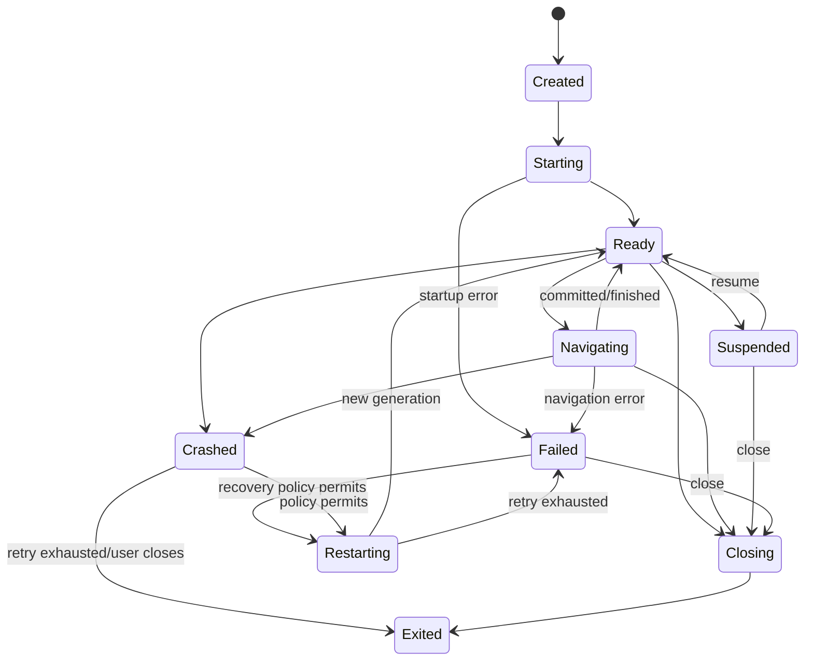

# Runtime Lifecycle Contract

> **Status:** provisional (PR-015)
> **Related:** ADR-004, ARCHITECTURE.md §7

## States

## Transitions

| From | To | Trigger | Side effects |
|---|---|---|---|
| Created | Starting | `EngineInstanceSpec` accepted | Resources allocated |
| Starting | Ready | `EngineReady` event | Engine accepts commands |
| Starting | Failed | startup error | `EngineCrashed` event; resources freed |
| Ready | Navigating | `Navigate` command | `NavigationStarted` event |
| Navigating | Ready | `NavigationFinished` | Tab state updated |
| Navigating | Failed | `NavigationFailed` | Error recorded |
| Ready | Closing | `Shutdown` command | Webviews dropped |
| Closing | Exited | event loop drained | `EngineExited` event |
| Ready | Crashed | engine panic | `EngineCrashed` event |
| Crashed | Restarting | policy permits | New generation created |
| Restarting | Ready | restart succeeds | `EngineReady` event |
| Restarting | Failed | retry exhausted | `EngineExited` event |

## Terminal states

- `Exited`: engine instance is fully destroyed. Resources are freed. No further commands accepted.
- `Failed` with no restart: equivalent to terminal `Exited` with error.

## Non-allowed transitions

Any transition not listed above MUST fail closed:
- Receiving a `Navigate` while `Starting` → rejected with `NotSupported`
- Receiving `Shutdown` while `Crashed` → rejected with `NotSupported`
- Transition from `Exited` to any state → rejected with `NotSupported`

## Cancellation semantics

- `Stop` command cancels the current navigation: `NavigationCancelled` event emitted
- `Shutdown` cancels all pending commands: `CommandCancelled` events for each
- After `Exited`, all pending commands return `CommandCancelled`

## Versioning

- `ENGINE_API_VERSION = 1`
- Unknown versions rejected by both sides of the contract
- Breaking changes require version bump and superseding ADR
