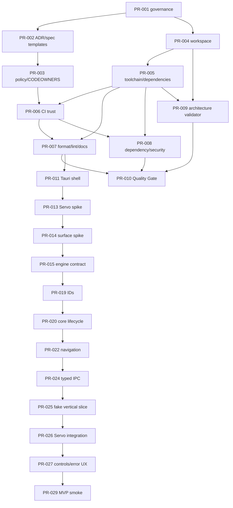

# EXECUTION_MAP.md — mapa de execução

## Como usar

`ROADMAP.md` define os estágios; `PR_PLAN.md` define os IDs e dependências; `docs/pr-dag.yaml` é a autoridade machine-readable dos edges. Issues usam o mesmo ID estável e Draft PRs usam o ID no título/branch. Números `#N` do GitHub devem ser preenchidos somente após a criação autenticada.

## Milestones → Issues → gates

| Milestone | Issues do plano | Objetivo verificável | Gate de saída |
|---|---|---|---|
| M0 | `PR-001`–`PR-010` | governança, workspace, toolchain, CI e arquitetura verificável | quality gate local, manifests válidos, policy versionada |
| M1 | `PR-011`–`PR-018` | shell/surface/engine feasibility | spikes Servo/Tauri, surface, frame, input, lifecycle e OS evidence |
| M2 | `PR-019`–`PR-029` | core + single-tab MVP experimental | lifecycle/IPC/E2E real na plataforma de referência |
| M3 | `PR-030`–`PR-041` | tabs, sessions, profiles e browser state | persistência atômica, recovery e regressões |
| M4 | `PR-042`–`PR-048` | security/privacy | threat scenarios e negative paths |
| M5 | `PR-049`–`PR-056` | WPT, OS, performance e stress | expectations, artifacts por OS e baselines |
| M6 | `PR-057`–`PR-060` | release engineering | signed/provenanced canary e recovery |
| M7 | `PR-061`–`PR-062` | Alpha/Beta decision | gates machine-readable e claims limitados |
| M8 | `PR-063`–`PR-070` | isolation e Stable decision | engine host separado, adversarial evidence e drills |

## Wave 001

A primeira wave materializada contém somente contratos planning-only para o bootstrap:

```text
PR-001 → PR-002 → PR-003
   └──→ PR-004 → PR-005
```

Os Draft PRs podem existir simultaneamente para tornar o DAG visível, mas cada corpo registra dependências reais e permanece Draft. Nenhum código de navegador é incluído.

## Mapa de dependências



O Mermaid é apenas a visão operacional. Edges completos, dependências indiretas e gates de ADR continuam em `docs/pr-dag.yaml`.

## Draft PR contract

Todo Draft PR deve conter:

- `Related Issue` com o número real e o ID estável;
- Objective, Context, Dependencies, Scope e Out of Scope;
- Implementation Plan sem arquitetura nova;
- Files/Components Expected;
- Testing Plan e Acceptance Criteria;
- Security, Documentation, Rollback, Risks e CI Gates;
- checklist de PR adequada ao tipo de mudança;
- estado explícito `PLANNING_ONLY` quando não houver implementação nesta wave.

## Estado e atualização

`CURRENT_STATE.md` contém o snapshot operacional atual. A materialização deve atualizar o mapa `PR-ID → Issue # → Draft PR # → head SHA` após cada criação e verificar que o corpo das Issues/PRs usa os números reais, sem substituir os IDs estáveis.

## Snapshot GitHub — Wave 001

| Stable ID | Issue | Draft PR | Branch | Head SHA |
|---|---:|---:|---|---|
| `PR-001` | #1 | #71 | `docs/pr-001-repository-governance` | `754313c4a7ce65e4e3bb6609d4b896da3bf34302` |
| `PR-002` | #2 | #72 | `docs/pr-002-adr-spec-templates` | `fda370ee88d0f432c246cc53c297a66b85fa31be` |
| `PR-003` | #3 | #73 | `docs/pr-003-policy-contracts` | `6c3b8ce4770d3203bdde02a1faa9afd4099ef004` |
| `PR-004` | #4 | #74 | `docs/pr-004-workspace-contract` | `ae6c619a88e51fb856bd58d2199666d49d945b9c` |
| `PR-005` | #5 | #75 | `docs/pr-005-dependency-policy` | `20f03733935744d467147bdc59de52112444fd70` |

The Draft PRs are open for sequencing visibility, not merge eligibility. They are based on the planning baseline because predecessors have not merged; body-level `Depends on` and `Blocked until` contracts remain binding.
